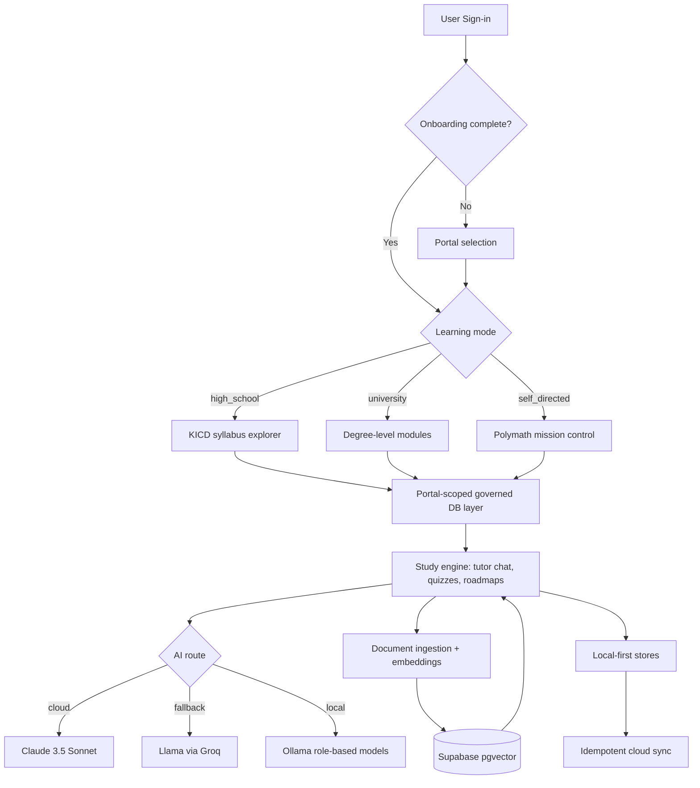

# EasyTutor

**A portal-mapped, offline-capable AI learning operating system.** EasyTutor detects
whether a learner is in the Kenyan high-school syllabus (KICD), a university degree
programme, or a self-directed Polymath path — and re-architects its prompts, roadmaps,
quizzes, and retrieval scope to match.

It runs against hosted AI (Anthropic Claude → Groq fallback) **or fully locally** via
Ollama, with real document ingestion and RAG (pgvector), and local-first sync that never
silently drops learner progress.

[](https://expo.dev)
[](https://reactnative.dev)
[](https://supabase.com)
[](https://ollama.com)
[](https://www.typescriptlang.org)

**Live web build:** https://easytutor-omega.vercel.app

---

## What it does

EasyTutor is a multi-portal academic operating system, not an AI wrapper. One app,
three governed learning identities:

| Portal (`portal_type`) | Learner | Experience |
|---|---|---|
| `high_school` | KCSE / KICD student | Syllabus-aligned subjects & Form 1–4 topics, exam-style quizzes |
| `university` | Undergraduate | Degree-level depth (Medicine, Engineering, Law, Architecture) |
| `knowledge_explorer` | Self-directed / Polymath | Any free-form goal → an architected roadmap, Socratic tutor chat |

Every governed read/write resolves a portal through `portalFromMode()`, stamps
`user_id` / `portal_type` / `updated_at`, and goes through the database layer — never a
magic string and never a direct Supabase call from UI.

---

## Capability highlights (v1.0.0)

### Multi-portal curriculum
- Three portal-mapped surfaces with distinct prompts, depth, and branding.
- High School pre-seeded with 12 KCSE subjects; University with degree programmes;
  Polymath accepts arbitrary free-form topics.

### Real RAG (documents → grounded answers)
- Ingest documents through the governed layer with deterministic chunk ids.
- Embeddings via Ollama (`nomic-embed-text`, 384-dim) → `pgvector`.
- `match_document_chunks` is portal/taxonomy/curriculum/school/namespace-scoped and
  returns chunk metadata; retrieval fails closed (returns `[]`, never a false match).
- The tutor chat injects the top-k retrieved chunks into the system prompt, with a
  visible "retrieving from your docs" indicator.

### Offline-capable local AI
- Run entirely on LAN with Ollama — no hosted API key required.
- **Role-based model routing** with availability detection from `/api/tags`:
  | Role | Default model |
  |---|---|
  | reasoning / chat | `deepseek-r1:14b` |
  | agent | `hermes3:8b` |
  | coding | `qwen2.5-coder:7b` |
  | embedding / RAG | `nomic-embed-text` |
- Both the chat and embedding models are user-configurable and shown with
  AVAILABLE / NOT PULLED / UNKNOWN badges. A missing model fails closed with the exact
  `ollama pull` command — it is never silently swapped.

### Reliability & AI integrity
- Multi-provider fallback with timeouts and exponential-backoff retries
  (`lib/ai/reliability.ts`), reporting an explicit source
  (`cache` / `local` / `cloud` / `offline_fallback`).
- Zod-validated AI JSON with a strict validation-retry loop.
- Governance doctrine: fail closed, no silent drops, enforcement at the real boundary.

### Local-first progress
- Zustand + AsyncStorage persistence; Supabase sync through the governed layer.
- `learning_goals` (RLS, unique per user+topic) persist Polymath goals idempotently and
  rehydrate across devices. Local progress is never overwritten by a cloud refresh.

---

## Architecture



---

## Tech stack

- **Frontend:** React Native 0.83.6 · Expo SDK 55 · Expo Router · NativeWind
- **State:** Zustand + AsyncStorage (local-first, persistent)
- **Backend:** Supabase PostgreSQL, RLS, pgvector (`vector(384)`)
- **AI:** Anthropic Claude 3.5 Sonnet · Groq Llama fallback · Ollama (local, role-routed)
- **Validation:** Zod
- **Quality gates:** TypeScript strict · ESLint · Vitest · architecture boundary audit · QA runner

---

## Getting started

### 1. Install
```bash
git clone https://github.com/dmuhoro/easytutor.git
cd easytutor
npm install --legacy-peer-deps
```

### 2. Configure environment
Create `.env.local` (git-ignored):
```env
EXPO_PUBLIC_SUPABASE_URL=your_url
EXPO_PUBLIC_SUPABASE_ANON_KEY=your_key
EXPO_PUBLIC_ANTHROPIC_API_KEY=your_key
```

### 3. Database
- **Existing project:** paste `supabase/migrations/run-all.sql` into the Supabase SQL
  editor (adds the hardened RAG RPC + Polymath schema and drops the legacy overloads).
- **Fresh project:** apply `supabase/schema.sql`, then `CREATE EXTENSION IF NOT EXISTS
  vector;` **before** `supabase/migrations/run-all.sql`.

### 4. Run
```bash
npx expo start          # mobile (Expo Go)
npm run web             # web
```

### 5. Local AI (optional, fully offline)
```bash
ollama pull deepseek-r1:14b   # reasoning / chat
ollama pull nomic-embed-text  # embeddings for RAG
```
Then set the Ollama server URL (your machine's LAN IP, no `/v1`) in **Settings**.

---

## Quality gates

All must be green before a push:

```bash
npm run typecheck   # tsc --noEmit, 0 errors
npm run lint        # eslint, 0 errors
npm test            # vitest, 41 files / 181 tests
npm run build       # npx expo export --platform web
node scripts/architecture/validate_boundaries.js
node scripts/qa/qa_runner.js
```

---

## Documentation & governance

- **`CONSTITUTION.md`** — execution-safety doctrine (fail closed, real-boundary
  enforcement, evidence before done).
- **`STATUS.md`** — verified live / stubbed / blocked state (single source of truth).
- **`docs/adr/`** — architecture decision records (ADR-001..007).
- **`sprints/`** — sprint records; evidence under `docs/evidence/`.
- **`CHANGELOG.md`** — release history.
- **`scripts/live-proof-checklist.md`** — 10 end-to-end flows to verify against a real
  Supabase instance, Ollama endpoint, and device.

> Live-network round-trips (real Supabase + physical Ollama) are not proven in-repo;
> they require credentials and a device on the same network. See `STATUS.md`.

---

## License

MIT © Daniel Muhoro
