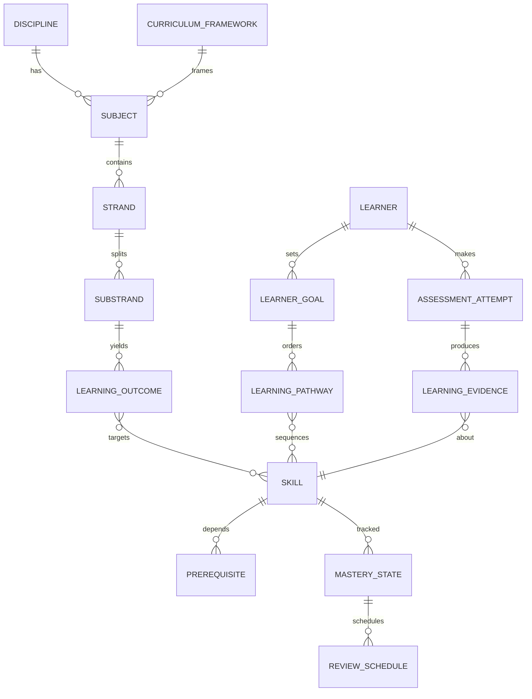

# Learning Domain Diagram

```mermaid
erDiagram
  DISCIPLINE ||--o{ SUBJECT : has
  CURRICULUM_FRAMEWORK ||--o{ SUBJECT : frames
  SUBJECT ||--o{ STRAND : contains
  STRAND ||--o{ SUBSTRAND : splits
  SUBSTRAND ||--o{ LEARNING_OUTCOME : yields
  LEARNING_OUTCOME }o--o{ SKILL : targets
  SKILL ||--o{ PREREQUISITE : depends
  LEARNER ||--o{ LEARNER_GOAL : sets
  LEARNER_GOAL ||--o{ LEARNING_PATHWAY : orders
  LEARNING_PATHWAY }o--o{ SKILL : sequences
  LEARNER ||--o{ ASSESSMENT_ATTEMPT : makes
  ASSESSMENT_ATTEMPT ||--o{ LEARNING_EVIDENCE : produces
  LEARNING_EVIDENCE }o--|| SKILL : about
  SKILL ||--o{ MASTERY_STATE : tracked
  MASTERY_STATE ||--o{ REVIEW_SCHEDULE : schedules
```